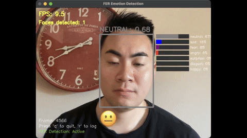

# 🧠 Emoji Cam

**Emoji Cam** is a real-time facial expression recognition system that analyzes emotions from webcam input and overlays emoji representations accordingly. It combines facial emotion detection, live video processing, and a modular GUI pipeline to deliver an expressive and intuitive visual experience.

---

## 📸 Demo Preview

<!-- Replace 'demo.gif' with the actual filename of your GIF -->

---

## 🔍 What It Does

- 🧠 **Emotion Detection** using the [FER library](https://github.com/justinshenk/fer) and MTCNN face detector  
- 🎥 **Real-Time Webcam Feed** with live facial tracking  
- 😄 **Emoji Overlay** on faces based on detected emotions  
- 📈 **CSV Logging & Analytics** to track emotional trends over time  
- 📊 **Graph Visualizations**: emotion timeline scatter plot + overall distribution bar chart  

---
